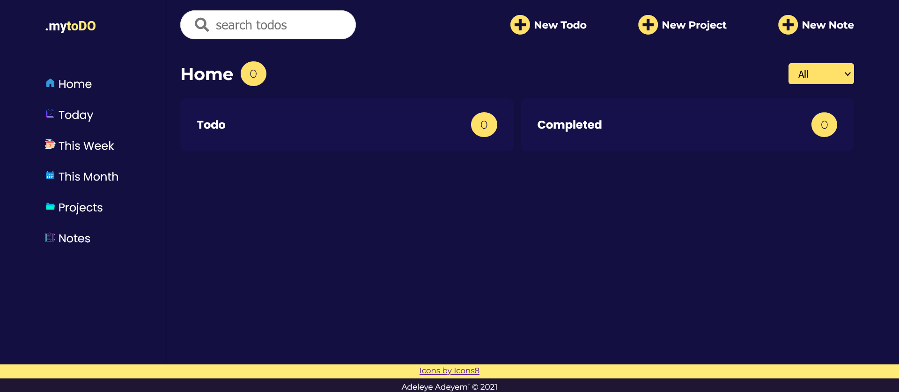

# TO-DO: Productivity App

Keep track of tasks with custom project folders and notes.

- Save to-do items to the default project (General) or create custom projects.
- View to-do details, edit, delete and check off items as complete.
- Assign three priority levels to assign to-do items.
- Number of completed and uncompleted todos are shown;
- Items automatically sorted according to date of input (latest first).
- Data saved to local storage.

[Live App](https://a-adeleye.github.io/todo/)

Feature ideas to implement in the future.

- Responsive design for smaller devices.
- User login and project/note sharing between users.
